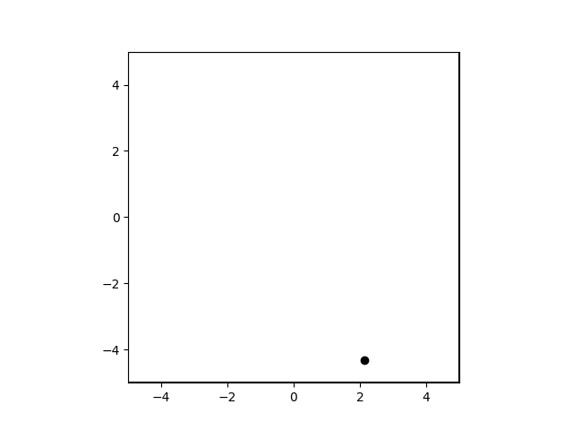

## O que é o Phystem?

Phystem é uma estrutura para auxiliar na construção e exploração de sistemas físicos. Essencialmente ele consiste nos seguintes componentes:

- Creator: Responsável pela criação da configuração inicial do sistema.
- Solver: Responsável pela integração temporal do sistema.
- Collector: Responsável pela coleta de dados do sistema.
- Simulation: Aplicação que irá rodar a simulação.

Cada componente deve ser implementado pelo usuário. Explicações mais detalhadas para cada sistema do phystem são dadas no decorrer desse documento.

Caso você esteja interessado em utilizar os sistemas físicos já implementados, clique em [Como utilizar os sistemas físicos já implementados com o phystem?](#como-utilizar-os-sistemas-físicos-já-implementados-com-o-phystem)

## Como utilizar o Phystem?
Para demonstrar sua utilização, vamos implementar um único caminhante aleatório. Os requisitos do nosso sistema são os seguintes:

- Forma da caminhada: Rapidez constante com direção da velocidade variando de forma aleatória, com intensidade da variação controlável.  
- Espaço do sistema: Região quadrada com bordas periódicas.
- Configuração inicial: Colocar o caminhante em uma posição aleatório do espaço, com direção da velocidade aleatória.

Cada sistema do phystem possui uma classe base, que contém seu esqueleto. Para realizar sua implementação precisamos herdar de tal base. 
> ⚠️ 
>
> 1. Daqui em diante vou assumir que você clonou o phystem e tem o caminho da pasta "lib" adicionado ao PYTHONPATH.
> 2. Em blocos de código, o primeiro comentário contém o nome do arquivo onde o código deveria estar.

### 0. Organização dos arquivos

Para fins de organização, cada sistema será coloca em arquivos separados. Ao fim desse tutorial, a estrutura dos arquivos deve ser a seguinte

```
lib
└── phystem

random_walker
├── creator.py
├── solver.py
├── configs.py
├── simulation.py
└── main.py
```

### 1. Configuração inicial
O `Creator` deve implementar o método `create` que deve retornar os dados da configuração inicial. Então, precisamos decidir como os dados que representam a configuração do sistema são estruturados. Nesse caso, vamos optar em representar a posição e velocidade por uma lista, e a estrutura da configuração do sistema simplesmente será outra lista com a posição e velocidade.

``` python
# creator.py

import random
from math import pi, cos, sin

from phystem.core.creators import CreatorCore

class Creator(CreatorCore):
    def __init__(self, speed: float,  size: int, rng_seed: int = None) -> None:
        super().__init__(rng_seed)
        self.speed = speed # Rapidez do caminhante.
        self.size = size # Tamanho do lado do espaço do sistema.

    def create(self):
        # Posição inicial
        x = self.size/2 * (random.random() * 2 - 1)
        y = self.size/2 * (random.random() * 2 - 1)
        self.pos = [x, y]

        # Velocidade inicial
        angle = 2* pi * random.random()
        self.vel = [self.speed * cos(angle), self.speed * sin(angle)]

        config = [self.pos, self.vel]
        return config
```

### 2. Solver
Prosseguindo, vamos implementar quem evolui o nosso caminhante com o tempo, o `Solver`. Ele deve implementar o método `update` que deve realizar a execução de um passo temporal.

``` python
# solver.py

import random
from math import pi, cos, sin

from phystem.core.solvers import SolverCore

class Solver(SolverCore):
    def __init__(self, pos0: list[float], vel0: list[float], noise_strength: float, size: int, dt: float) -> None:
        super().__init__()
        self.size = size

        # Configuração inicial do sistema
        self.pos = pos0
        self.vel = vel0
        
        self.noise_strength = noise_strength

        # Tamanho do passo temporal
        self.dt = dt

        # Tempo da simulação
        self.time = 0

    def update(self) -> None:
        # Atualização da posição
        self.pos[0] += self.dt * self.vel[0]
        self.pos[1] += self.dt * self.vel[1]
        
        # Atualização da velocidade
        # Rotaciona a mesma pelo ângulo d_angle
        d_angle = self.noise_strength * pi * (random.random() * 2 - 1)
        new_vx = cos(d_angle) * self.vel[0] + sin(d_angle) * self.vel[1]
        new_vy = -sin(d_angle) * self.vel[0] + cos(d_angle) * self.vel[1]
        
        self.vel[0] = new_vx
        self.vel[1] = new_vy

        # Implementação das bordas periódicas
        for i in range(2):
            if self.pos[i] > self.size/2:
                self.pos[i] = -self.size/2
            elif self.pos[i] < -self.size/2:
                self.pos[i] = self.size/2

        self.time += self.dt
```

> ℹ️
>
> Caso você esteja implementando um sistema físico que necessita de muito poder computacional, implementar o solver puramente no python não é uma ótima escolha. Uma possível solução é realizar a construção do solver em uma linguagem que apresenta ótimo desempenho, e chamá-la no solver do python. Uma das formas de fazer isso é utilizando o [pybind11](https://pybind11.readthedocs.io/en/stable/index.html#), uma biblioteca que permite criar módulos do python que chamam códigos feitos em c++. 

### 3. Configurações
Normalmente existem diversas configuração utilizadas para explorar um sistema físico, então para facilitar seu gerenciando, o phystem espera que elas estejam encapsuladas em classes. Por padrão, existem 4 tipos de configurações que uma aplicação de simulação espera receber

1. Configurações da dinâmica do sistema.
2. Configurações do espaço físico em que o sistema se encontra.
3. Configurações utilizadas pelo `Creator`.
4. Configurações de execução.

O item 4 possui implementação padrão que servirá para os propósitos desse sistema. Os demais itens necessitam de implementação. Por questão de organização, suas classes serão implementada em um arquivo separado.

``` python
# configs.py

class DynamicCfg:
    def __init__(self, vo: float, noise_strength: float):
        '''
        Parâmetros:
            vo: 
                Rapidez do caminhante.
            
            noise_strength: 
                Intensidade do ruído da caminhada.
        '''
        self.vo = vo
        self.noise_strength = noise_strength
    
class CreatorCfg:
    def __init__(self, speed: float,  size: int) -> None:
        '''
        Parâmetros:
            speed: 
                Rapidez utilizada na velocidade.
            
            size: 
                Lado do espaço físico.
        '''
        self.speed = speed
        self.size = size
    
class SpaceCfg:
    def __init__(self, size: float) -> None:
        '''
        Parâmetros:
            size: 
                Lado do espaço físico.
        '''
        self.size = size
```


> ℹ️
>
> Para pequenas simulação, escrever as configurações dessa forma pode parecer uma sobrecarga desnecessária, no entanto, isso facilita a organização e gerenciamento conforme a quantidade de configurações aumentam. Em particular, esse formato facilita o armazenamento das configuração utilizadas em uma simulação feita (o phystem armazena as configurações em arquivos .yalm)


### 4. Aplicação da simulação

Agora só nos resta implementar o sistema que de fato roda a simulação. Existem diferentes modos de execução

1. Renderização em tempo real
2. Coleta de dados
3. Replay de dados
4. Geração de vídeos

Cada modo necessita que o usuário trabalhe um pouco para realizar sua implementação. Vamos apenas nos concentrar no item 1. A classe base de uma aplicação de simulação é o `SimulationCore`, ela necessita que os métodos `get_solver` e `get_creator` sejam implementados, cujas tarefas são retornar instâncias dos `Solver` e `Creator` que serão utilizadas na simulação.

``` python
# simulation.py

from phystem.core.simulation import SimulationCore

from creator import Creator 
from solver import Solver 
from configs import SpaceCfg, CreatorCfg, DynamicCfg

class Simulation(SimulationCore): 
    # Essas linhas não são necessárias, elas apenas informam 
    # o tipo  das variáveis, informação útil para a completação  de
    # código funcionar bem.
    dynamic_cfg: DynamicCfg
    creator_cfg: CreatorCfg
    space_cfg: SpaceCfg
    solver: Solver

    def get_creator(self):
        return Creator(
            speed=self.creator_cfg.speed,
            size=self.creator_cfg.size,
        )
            
    def get_solver(self):
        po0, vel0 = self.creator.create()

        return Solver(
            po0, vel0,
            noise_strength = self.dynamic_cfg.noise_strength,
            size = self.space_cfg.size,
            dt = self.run_cfg.dt,
        )
```

Como queremos renderização em tempo real, também devemos implementar o método `run_real_time`, cuja função é configurar como o sistema físico é renderizado.

O sistema físico é renderizado utilizando o `matplotlib`, então a primeira tarefa a se fazer é criar uma figura do `matplotlib` e os devidos `Axes`. Vamos simplesmente mostrar a partícula andando, dessa forma apenas um `Axe` dará conta do trabalho. A criação desses objetos pode ser feita da seguinte forma:

``` python
# simulation.py

fig, ax_walker = plt.subplots()      
```

O phystem já possui um gráfico que renderiza partículas em um plano, que pode ser utilizado da seguinte forma:

``` python
# simulation.py

from phystem.gui_phystem import graph

particles_graph = graph.ParticlesGraph(
    ax=ax_walker, 
    pos=self.solver.pos, 
    space_size=self.space_cfg.size,
)
```

Ainda precisamos criar a função que avança o sistema no tempo (essa função é chamada em cada quadro da animação que será gerada). Nessa função, o `Solver` precisa executar um passo temporal e o gráfico precisa ser atualizado.

``` python
# simulation.py

def update(frame):
    self.solver.update()
    particles_graph.update()
```
> ℹ️
>
> Frequentemente é desejável realizar mais de um passo temporal por quadro, isso pode ser simplesmente feito chamando `solver.update` em um loop. A classe padrão da configuração de execução em tempo real possui o membro `num_steps_frame` que deve ser utilizado justamente para isso.

Por fim, precisamos rodar a aplicação que conterá a animação e mais algumas informações e controles que podem ser modificados ao gosto do usuário. Isso simplesmente é feito chamando o método `run_app` passando a figura criada e a função que avança o sistema no tempo.

``` python
# simulation.py

self.run_app(fig, update)
```

A implementação completa de `Simulation` fica assim:

``` python
# simulation.py

import matplotlib.pyplot as plt

from phystem.core.simulation import SimulationCore
from phystem.core.run_config import RealTimeCfg

from phystem.gui_phystem import graph

from creator import Creator 
from solver import Solver 
from configs import *

class Simulation(SimulationCore): 
    dynamic_cfg: DynamicCfg
    creator_cfg: CreatorCfg
    space_cfg: SpaceCfg
    solver: Solver

    def get_creator(self):
        return Creator(
            speed=self.creator_cfg.speed,
            size=self.creator_cfg.size,
        )
            
    def get_solver(self):
        po0, vel0 = self.creator.create()

        return Solver(
            po0, vel0,
            noise_strength = self.dynamic_cfg.noise_strength,
            size = self.space_cfg.size,
            dt = self.run_cfg.dt,
        )

    def run_real_time(self):
        fig, ax = plt.subplots() 
        
        particle_graph = graph.ParticlesGraph(
            ax=ax, 
            pos=self.solver.pos, 
            space_size=self.space_cfg.size,
        )

        def update(frame):
            self.solver.update()
            particle_graph.update()

        self.run_app(fig, update)
```

### 5. Como rodar a Simulação?
Para rodar a simulação, precisamos criar uma instância da simulação e chamar o método `run`. A instanciação de `Simulation` necessita que sejam passadas as configurações. Além daquelas implementadas no passo 3, também é  necessário passar a configuração de execução do modo de renderização em tempo real, um exemplo de uma possível configuração para uma simulação é a seguinte:

``` python
# main.py

from phystem.core.run_config import RealTimeCfg, IntegrationCfg

from configs import *
from simulation import Simulation

dynamic_cfg = DynamicCfg(
    vo=1,
    noise_strength= 0.1,
)

space_cfg = SpaceCfg(
    size=10,
)

creator_cfg = CreatorCfg(
    speed=dynamic_cfg.vo,
    size=space_cfg.size,
)

run_cfg = RealTimeCfg(
    IntegrationCfg(
        dt=0.1,
    ),
    num_steps_frame=1,
    fps=60,
)

sim = Simulation(creator_cfg, dynamic_cfg, space_cfg, run_cfg)
sim.run()
```

Se esse arquivo for executado, aparecerá uma janela com uma animação semelhante a essa



Poderíamos continuar com a nossa implementação adicionando muitas outras funcionalidades, algumas opções são

1. Cronometrar o tempo de execução dos passos temporais e exibi-lo na GUI.
2. Por padrão existem alguns botões na GUI gerada, mas é necessário implementar suas funcionalidades.
3. Setar uma pipeline de coleta de dados para realizar alguma análise.
4. Expandir o gráfico do caminhante para renderizar itens extras auxiliares para a depuração da aplicação, como um seta indicando a velocidade do caminhante.
5. Colocar múltiplos caminhantes (Talvez adicionar uma dinâmica de interação entre os caminhantes?)

Enfim, as possibilidades são infinitas! Mas esse tutorial termina por aqui. Espero que ele tenha sido esclarecedor e boa jornada na criação dos seus projetos!. 

## Como utilizar os sistemas físicos já implementados com o phystem?
O sub-pacote `phystem.systems` contém os sistemas físicos já implementados com o phystem. 

Em geral, para utilizá-los é necessário criar uma instância de `Simulation`, que está no módulo `simulation.py` do respectivo sistema, e rodar o método `run`. `Simulation` requer que sejam passadas as seguintes configurações

1. creator_cfg: Configurações da criação da configuração inicial do sistema.
2. dynamic_cfg: Configurações da dinâmica do sistema.
3. space_cfg: Configurações do espaço físico em que o sistema se encontra.
4. run_cfg: Configurações do modo de execução.

Os itens 1, 2 e 3 estão no módulo `configs.py` do respectivo sistema, então basta olhar nesse arquivo para saber como instanciar essas configurações.

O item 4 pode estar em dois locais:

1. Caso o sistema utiliza as configurações padrões de execução, elas se encontram em `phystem.core.run_config`
2. Caso o sistema extendeu tais configurações, elas se encontram no módulo `run_config.py` do respectivo sistema. 

> ⚠️
>
> 1. Caso você utilize um sistema que utiliza o módulo feito em c++ (ring e szabo), é necessaŕio compilar o código que gera tal módulo. Para tal, apenas é necessaŕio executar o script 
`build.sh` que está localiza na pasta `lib/phystem/cpp/pybind`. (Me Desculpem usuários do Windows, mas esse método não vai funcionar para vocês)
> 2. Alguns recursos utilizados do `matplotlib` requerem a versão 3.8 ou superior, então se você obtiver algum erro relacionado ao `matplotlib`, garanta que esse pré-requisito esteja satisfeito (Isso só poderá ser um problem no modo de execução em tempo real).  

No momento atual, existem os seguintes sistemas implementados:

### Ring
Implementação de múltiplos anéis ativos, com algumas pequenas modificações, apresentado em Teixeira [[1]](#1).


### Szabo
Implementação do modelo proposto para partículas ativas em Szabó [[2]](#2)


### Vicsek
Implementação do modelo proposto em Vicsek [[3]](#3). 
> ⚠️
> 
> A implementação não está completa, apenas tem uma versão do seu solver extremamente desorganizada.

### Random Walker
Sistema implementado no tutorial [Como utilizar o phystem](#como-utilizar-o-phystem).

## Referências
<a id="1">[1]</a> 
TEIXEIRA, E. F.; FERNANDES, H. C. M.; BRUNNET, L. G. A single active ring model with velocity self-alignment. Soft Matter, v. 17, n. 24, p. 5991–6000, 23 jun. 2021. 

<a id="2">[2]</a>
SZABÓ, B. et al. Phase transition in the collective migration of tissue cells: experiment and model. Physical Review. E, Statistical, Nonlinear, and Soft Matter Physics, v. 74, n. 6 Pt 1, p. 061908, dez. 2006.

<a id="3">[3]</a>
VICSEK, T. et al. Novel type of phase transition in a system of self-driven particles. Physical Review Letters, v. 75, n. 6, p. 1226–1229, 7 ago. 1995. 


